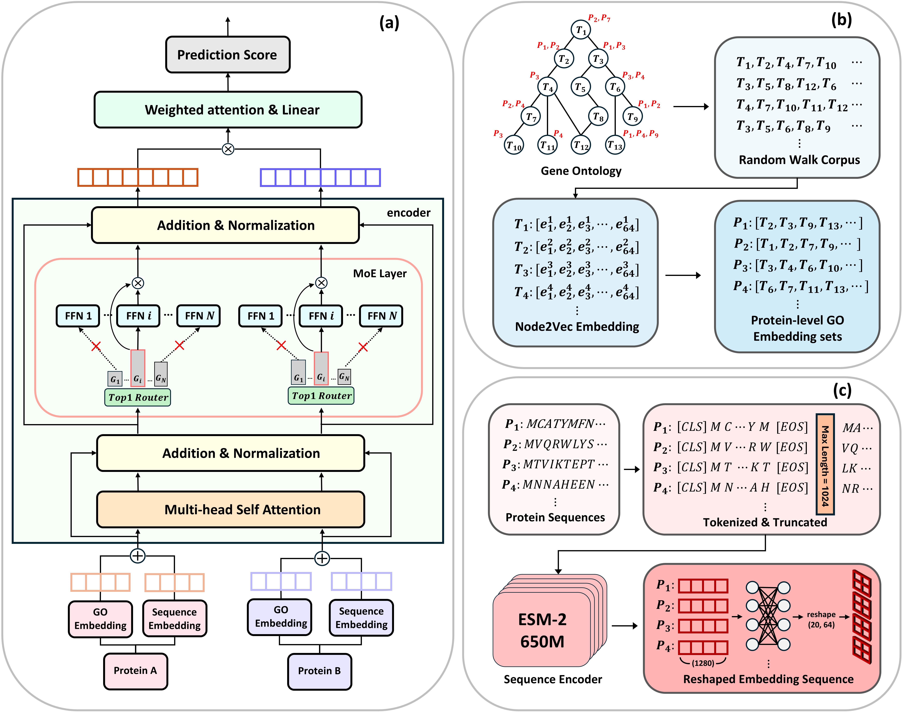

# PROMEOS

**PROMEOS** is protein‑protein interaction prediction using a Mixture of Experts and multimodal learning by integrating Ontology and Sequences.


## Model Architecture




## About
PROMEOS applies [your method/approach] to address [research problem].  
This repository provides:
- Data preprocessing
- Model training and evaluation
- End-to-end reproducibility of results

---

## Installation
Clone this repository and install the required dependencies:

```bash
git clone https://github.com/<your-username>/PROMEOS.git
cd PROMEOS
pip install -r requirements.txt
